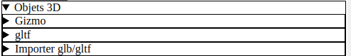
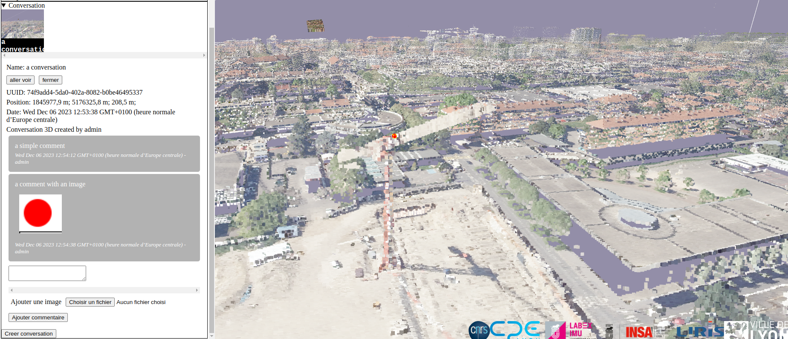

# User note

This document will cover all features of the web application GALERI3 and guide you how to use it.

## Index

- [User note](#user-note)
  - [Index](#index)
  - [Account creation](#account-creation)
  - [How to use the application](#how-to-use-the-application)
    - [Overview](#overview)
    - [Camera controls](#camera-controls)
    - [Parameters](#parameters)
      - [Controls speed](#controls-speed)
      - [Clipping plane](#clipping-plane)
      - [User interface width](#user-interface-width)
      - [Fold on camera move](#fold-on-camera-move)
      - [Color layers](#color-layers)
      - [Planar slab](#planar-slab)
      - [Elevation layer](#elevation-layer)
      - [Point cloud layer](#point-cloud-layer)
      - [Bookmark](#bookmark)
    - [Draging target orbit controls](#draging-target-orbit-controls)
    - [Measure](#measure)
    - [User information](#user-information)
    - [Object 3D](#object-3d)
      - [Gizmo](#gizmo)
      - [Objects 3D imported and validated](#objects-3d-imported-and-validated)
      - [Import object 3D](#import-object-3d)
      - [Update your object 3D](#update-your-object-3d)
    - [Conversation](#conversation)
      - [Open conversation](#open-conversation)
      - [Comment](#comment)
      - [Create conversation](#create-conversation)

## Account creation

First time you browse to the application you will have this screen:

Click on "Créer un compte":

This screen will appears:

There you can create your account by entering a nickname and a password then click "Créer un compte:

When your account has been created, a popup message appears:

For now your account is pending an admin has to validate it. Today there is no notifications for admins to know that your account is pending. Click ok and then return to the main page by clicking "Se connecter".

Once your account is validated you can enter your nickname and pseudo to connect into the application:

> Once you connect, an authentification token is stored into your cookies allowing to connect automatically in the future.

## How to use the application

### Overview

The first time you connect the application looks like this:

There is a main canvas where 3D scene is rendered and a left pan where you can find all tools of the application. You can hide this pan by clicking "cacher ui" button on the top right corner of the screen. In this pan an arrow like this  means that you can unfold a menu by clicking it, in contrary when you met an arrow like this  it means you can fold a menu.

### Camera controls

To move the camera there is an orbit controls working like so:

- left click then drag move the camera around the target of the orbit controls represent here by a red sphere
- right click then drag move target of the orbit controls in a plane parallel to the camera

### Parameters

Clicking "Paramètres" unfold this menu:

#### Controls speed

A slider to controls the speed of the orbit controls of the 3D scene.

#### Clipping plane

You can place a clipping plane with a gizmo in the 3D scene to clip 3D point cloud.

You can change the gizmo mode with first buttons:

"translate":

"rotate":

"Visible" checkbox enable/disable plane visibility.
"Enable" checkbox enable/disable clipping

Here you can see a visible plane with a clipping enabled:

#### User interface width

A slider to adjust size a the left pan

#### Fold on camera move

A checkbox to fold the left pan when the camera is moving.

#### Color layers

A tool to parameter color layers, on the image above there is only one color layer but several can be added. You an set the visibility of the color layer with a checkbox, and the opacity with a slider.  these arrows allows to set the order in which color layers are rendered.

#### Planar slab

The planar represents the slab on which color and elevation layers are applied. Same as color layers you can set visibility and opacity.

#### Elevation layer

Elevation layer is an heightmap applied to the planar slab, here you set the scale of the layer between 0 and 1.

#### Point cloud layer

Point cloud layer is a geometric layer, you can set visibility and opacity as color layers and planar slab. In addition you can set size of points into the 3D scene.

> /!\ When you are close of the points and the size is too high causing many points overlapping its can cause freeze of your computer due to the rendering

#### Bookmark

This tool allows to store camera point of view in your localStorage (meaning they exist only on your computer and they remain even after a tab reload). You can enter a point of view name then click "Add bookmark".

Here a bookmark called "A pointof view bookmarked" has been created, clicking "Select" will set the camera as it was when stored. Clicking "Delete" will delete this bookmark.

### Draging target orbit controls

This red circle can be drag and drop on the 3D scene to place easily the target of the orbit controls on the point cloud. If on the drag end there is no point intersecting nothing happen.

### Measure

Measure tool allows to take measure on the point cloud. First click "Ajouter chemin de mesure" button, your cursor change and becomes a cross. Now you can click on the point cloud to add a new point in your measure path.

1 point

2 points

3 points and so on...

You can exit the measure mode by typing Escape or clicking "stop mesurer" button.

You can delete the current measure path by clicking "Supprimer mesure" button.

At the bottom of the measure menu you can read "position point cliqué = ..." with the coordinate in meter of the last point clicked. added

### User information

First line is your nickname, second line is your role yours should be "default". You can click "Deconnexion" button to remove your authentification token from cookies, meaning you will have to reconnect to access to the application.

### Object 3D

This menu allows to import local object 3D in the [.glb/.gltf format](https://fr.wikipedia.org/wiki/GlTF) and to visualize ones already uploaded and validated.

#### Gizmo

Objects 3D can be moved into the 3D scene with a gizmo, this menu allows to change its mode. When an object 3D is selected with the gizmo you can press Escape to remove the gizmo from it.

#### Objects 3D imported and validated

In this menu appears all objects 3D already uploaded and validated.

> Click on the "Mettre à jour" button to refresh objects 3D list

Here only one object 3D call "Zeppelin" and created by admin user is present, by default it is invisible.

- "visualize" button will move the orbit controls target to the object 3D and make it visible 

- "visible" checkbox will switch object 3D visibility

> You can't modify objects 3D that are not yours. We will come back to this menu later [see](#update-your-object-3d)

#### Import object 3D

In this menu you can import your own object 3D (.glb/.gltf), click "Choisir un fichier" button and choose on your computer the object 3D you want to import.

A popup will show asking if you want to place your object 3d on the center of the screen. If your object 3D does not have a geographic position, you want to click "OK" button to actually see it in your 3D scene georeferenced.

You can import as many object 3D you want, here another object 3D is imported:

For each object 3D you can:

- Select it by clicking "selectionner" button.
- Delete it by clicking "Supprimer" button.
- Upload it to on the backend by clicking "Submit", when submitting a popup will ask you what's the name of the object 3D posted. An admin has to validate it before you can find it in the [latter gltf menu](#objects-3d-imported-and-validated)
- Download a .json file on your computer with the current world transformation of the object 3D (its matrix4).
- Apply one of these latter .json files on the object 3D by clicking "Choisir un fichier" after "Appliquer un fichier coord json" label and choosing on your computer the .json file.

#### Update your object 3D

When your object 3D is uploaded and validated by an admin, you can find it in the [gltf menu](#objects-3d-imported-and-validated)

Since it's your object 3D you have right to select it ("select" button) use the gizmo to modify it then to save modification on the backend ("update" button). You can also delete it ("supprimer" button).

### Conversation

This menu allows to have conversations around points of interest on the point cloud. Here there is already a conversation called "a conversation" the image of the icon represents the camera point of view when this conversation has been created.

#### Open conversation

 To open a conversation simply click on the icon of this latter, you can also click on yellow cube in the 3D scene (each one represents the position of a conversation).

On the top you can see the name of the conversation, its UUID, its position (the one of yellow cube) the date where it has been created and the author (here admin).

You can close a conversation by opening a new one or clicking "fermer" button. "aller voir" button will set the camera point of view with the one of the conversation. In this example clicking "aller voir" button will set view to the below point of view:

Here you can see the red sphere overlapping with the yellow cube of the conversation.

#### Comment

You can see comments posted by other users, here admin has writted 2 comments.

It's possible to add a comment to do so write in this text area your message.

 
Then you can add as many images you wish by clicking "Choisir fichier" button and choose an image on your computer.

Here two images has been picked  (you can remove them by clicking "Supprimer" button below the image), when your comment is finished you can add it to the conversation by clicking "Ajout commentaire" button.

Your comment has been added, now since this is your comment, you can:
 - Remove images (clicking "Supprimer" button below them).
 - Remove the comment itself bottom "Supprimer" button.
 - Edit the comment by clicking "editer" button . the message becomes a editable text area where you can modify it, click "annuler" button to not save your modification and click "Sauvegarder modification" to save it (note that today this is not possible to add images when editing a comment).

#### Create conversation

To create your conversation place the orbit controls target (the red sphere) where you want in the 3D scene and place the camera the way you want the point of view of this conversation to be.

Now you just have to click "Creer conversation", a popup appears on the center of the screen: 

Click "cancel" button to cancel the conversation creation or click "validate" button to create it. Your conversation should appears in the Conversation menu:

and also a yellow cube:

Note that since this is you conversation you can delete it by clicking "Supprimer conversation 3D" button.

