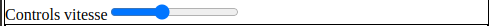

## User note

This document will cover all features of the web application GALERI3 and guide how to use it.

### Account creation

First time you browse to the application you will have this screen:

Click on "Créer un compte":

This screen will appears:

There you can create your account by entering a nickname and a password then click "Créer un compte:

When your account has been created, a popup message appears:

For now your account is pending an admin has to validate it. Today there is no notifications for admins to know that your account is pending. Click ok and then return to the main page by clicking "Se connecter".

Once your account is validated you can enter your nickname and pseudo to connect into the application:

> Once you connect, an authentification token is stored into your cookies allowing to connect automatically in the future.

### How to use the application

#### Overview

The first time you connect the application looks like this:

There is a main canvas where 3D scene is rendered, to move the camera there is an orbit controls working like so:

- left click then drag move the camera around the target of the orbit controls represent here by a red sphere
- right click then drag move target of the orbit controls in a plane parallel to the camera

There is also a left pan where you can find all tools of the application, you can hide this pan by clicking "cacher ui" button on the top right corner of the screen.

An arrow like this  means that you can unfold a menu by clicking it, in contrary when you met an arrow like this  it means you can fold a menu.

#### Parameters

Clicking "Paramètres" unfold this menu:

##### Controls speed

A slider to controls the speed of the orbit controls of the 3D scene.

##### Clipping plane

You can place a clipping plane with a gizmo in the 3D scene to clip 3D point cloud.

You can change the gizmo mode with first buttons:

"translate":

"rotate":

"Visible" checkbox enable/disable plane visibility.
"Enable" checkbox enable/disable clipping

Here you can see a visible plane with a clipping enabled:

##### User interface width

A slider to adjust size a the left pan

##### Fold on camera move

A checkbox to fold the left pan when the camera is moving.

##### Color layers

A tool to parameter color layers, on the image above there is only one color layer but several can be added. You an set the visibility of the color layer with a checkbox, and the opacity with a slider.  these arrows allows to set the order in which color layers are rendered.

##### Planar slab

The planar represents the slab on which color and elevation layers are applied. Same as color layers you can set visibility and opacity.

##### Elevation layer

Elevation layer is an heightmap applied to the planar slab, here you set the scale of the layer between 0 and 1.

##### Point cloud layer

Point cloud layer is a geometric layer, you can set visibility and opacity as color layers and planar slab. In addition you can set size of points into the 3D scene.

> /!\ When you are close of the points and the size is too high causing many points overlapping its can cause freeze of your laptop due to the rendering

##### Bookmark

This tool allows to store camera point of view in your localStorage (meaning they exist only on your laptop and they remain even after a tab reload). You can enter a point of view name then click "Add bookmark".

Here a bookmark called "A pointof view bookmarked" has been created, clicking "Select" will set the camera as it was when stored. Clicking "Delete" will delete this bookmark.

#### Draging target orbit controls

This red circle can be drag and drop on the 3D scene to place easily the target of the orbit controls on the point cloud. If on the drag end there is no point intersecting nothing happen.

#### Measure

Measure tool allows to take measure on the point cloud. First click "Ajouter chemin de mesure" button, your cursor change and becomes a cross. Now you can click on the point cloud to add a new point in your measure path.

1 point

2 point

3 and so on...

You can exit the measure mode by typing Escape or clicking "stop mesurer" button.

You can delete the current measure path by clicking "Supprimer mesure" button.

At the bottom of the measure menu you can read "position point cliqué = ..." with the coordinate in meter of the last point clicked. added